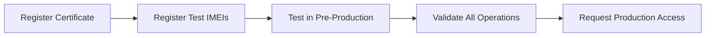

## Overview

The Alta Multes API is available in two environments: pre-production (for testing) and production (for live operations).

## Environment URLs

### Production

**Base URL:**
```
https://pda.orgt.diba.cat/RestMultesPDA/svcMultesPDA.svc/rest/
```

**Use for:**
- Live traffic infraction submissions
- Real municipality operations
- Production data that enters the ORGT system

<Warning>
Never use production for testing unless using test agent codes (starting with "USU").
</Warning>

### Pre-Production (Testing)

**Base URL:**
```
https://pdaprv16.orgt.diba.cat/RestMultesPDA/svcMultesPDA.svc/rest/
```

**Use for:**
- Initial development and testing
- Certificate authentication verification
- Data format validation
- Integration testing

<Info>
All new integrations must complete testing in pre-production before production access is granted.
</Info>

## Endpoint Construction

To call an endpoint, append the endpoint name to the base URL:

### GET Request Example

```bash
# Pre-production ObtenirRang endpoint
https://pdaprv16.orgt.diba.cat/RestMultesPDA/svcMultesPDA.svc/rest/ObtenirRang?pImei=123&pEstat1=1&pEstat2=1
```

### POST Request Example

```bash
# Pre-production AltaMulta endpoint
https://pdaprv16.orgt.diba.cat/RestMultesPDA/svcMultesPDA.svc/rest/AltaMulta
```

## Certificate Requirements

### Same Certificate for Both Environments

<Note>
The same client certificate is used for both pre-production and production environments.
</Note>

Before accessing either environment:

1. Generate a certificate for your organization
2. Submit the **public key** to ORGT via the adhesion process
3. ORGT installs your certificate on both servers
4. Use the certificate for all API requests

### Certificate Authentication

All endpoints require mutual TLS:

- **Client certificate**: Identifies your organization/application
- **Server certificate**: Validates you're connecting to ORGT servers

```bash
# Example with curl using certificate
curl --cert client-cert.pem --key client-key.pem \
  https://pdaprv16.orgt.diba.cat/RestMultesPDA/svcMultesPDA.svc/rest/ObtenirMunicipis
```

## IMEI Registration

### Environment-Specific IMEIs

<Warning>
Device IMEIs must be registered with ORGT separately for each environment.
</Warning>

Before using a device:

1. **Pre-production**: Communicate test IMEIs to ORGT
2. **Production**: Communicate production IMEIs to ORGT
3. Wait for ORGT to register IMEIs in their database
4. Use registered IMEIs in API calls

### Adding New Devices

When adding new devices:

- Communicate the new IMEI to ORGT
- ORGT registers it in the appropriate environment
- Begin using the IMEI in API requests

## Testing Workflow

### 1. Pre-Production Testing



**Required tests:**
- Certificate authentication
- All endpoints your application uses
- XML field ordering (especially AltaMulta)
- Error handling
- Master file synchronization

### 2. Production Connectivity Testing

After pre-production approval:

<Info>
Test production connectivity using agent codes starting with "USU" (e.g., "USU1"). These test infractions are not entered into the system.
</Info>

```xml
<!-- Test infraction with USU agent code -->
<MultaType xmlns="http://schemas.datacontract.org/2004/07/WcfMultesPDA">
  <Cdagen>USU1</Cdagen>  <!-- Test agent code -->
  <Cdclie>088</Cdclie>
  <!-- ... other fields ... -->
</MultaType>
```

### 3. Production Operations

Once testing is complete:

- Switch to real agent codes
- Submit real infractions
- Data enters the ORGT system

## Additional Resources

### Schema Validation

Validate your XML against the schema:

**Pre-production schema:**
```
https://pdaprv16.orgt.diba.cat/RestMultesPDA/schema/svcMultesPDA.xsd
```

**Production schema:**
```
https://pda.orgt.diba.cat/RestMultesPDA/schema/svcMultesPDA.xsd
```

### WSDL Reference

While the API is REST-based, WSDL documentation provides field descriptions:

```
https://pda.orgt.diba.cat/WcfMultesPDA/svcMultesPDA.svc?singleWsdl
```

<Note>
You can cancel the certificate request dialog to view the WSDL. Field names and descriptions apply to both SOAP and REST versions.
</Note>

## Environment Comparison

| Feature | Pre-Production | Production |
|---------|---------------|------------|
| **Base URL** | pdaprv16.orgt.diba.cat | pda.orgt.diba.cat |
| **Certificate** | Same as production | Same as pre-production |
| **IMEI Registration** | Test IMEIs | Production IMEIs |
| **Data Persistence** | Test data | Real ORGT data |
| **Testing Allowed** | Yes | Only with USU codes |
| **Access Requirement** | Adhesion form | Pre-production success |

## Support

For environment access issues:

1. Verify certificate is installed on ORGT servers
2. Confirm IMEIs are registered for the environment
3. Check that adhesion form has been processed
4. Contact ORGT support via EACAT

## Next Steps

- [API Overview](/api/overview) - Architecture and requirements
- [Error Codes](/api/error-codes) - Error code reference
- [FerLogin](/api/endpoints/fer-login) - Authenticate your device
- [AltaMulta](/api/endpoints/alta-multa) - Register traffic violations
